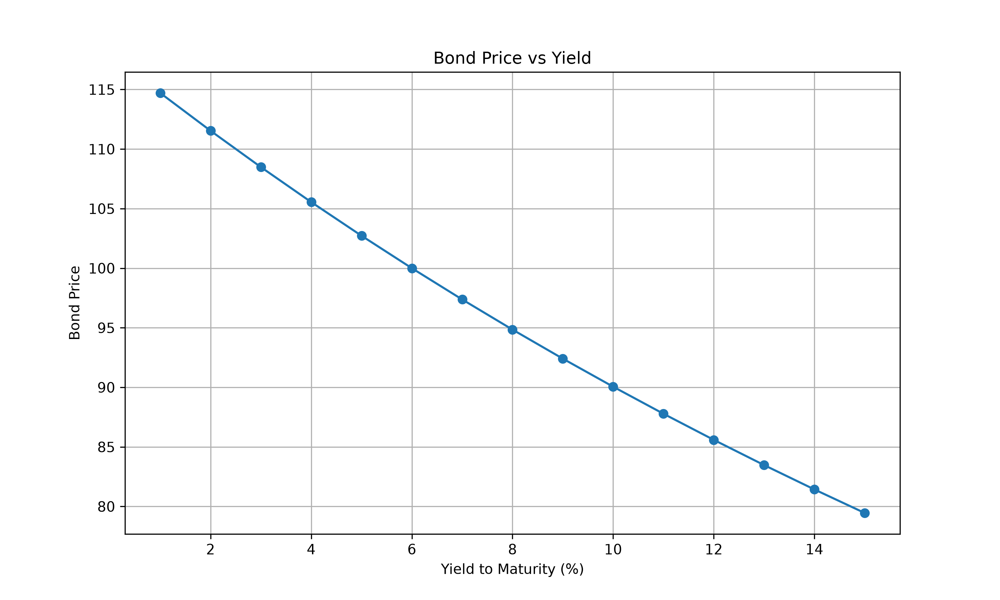

# Fixed Income Analytics using Python

## Overview

This project demonstrates fundamental **Fixed Income Analytics** using Python. It performs bond valuation and analyzes the relationship between bond prices and interest rates. The project also calculates important fixed-income risk measures used by investment professionals and risk managers.

---

## Features

- Bond Price Calculation
- Bond Price vs. Yield Relationship
- Macaulay Duration
- Modified Duration
- Convexity
- Interest Rate Sensitivity Analysis

---

## Libraries Used

- NumPy
- Pandas
- Matplotlib

---

## Financial Concepts Covered

- Present Value
- Yield to Maturity (YTM)
- Bond Pricing
- Price-Yield Relationship
- Macaulay Duration
- Modified Duration
- Convexity
- Interest Rate Risk

---

## Applications

This project can be applied in:

- Fixed Income Analytics
- Treasury Management
- Asset Liability Management (ALM)
- Interest Rate Risk Management
- Portfolio Risk Analysis
- Quantitative Finance

---

## Project Structure

```
Fixed_Income_Analytics_Python/
│
├── Project_Bond_Fixed_Income.py
├── requirements.txt
├── README.md
├── bond_price_vs_yield.png
└── .gitignore
```

---

## Installation

Clone the repository:

```bash
git clone https://github.com/your-username/Fixed_Income_Analytics_Python.git
```

Install the required libraries:

```bash
pip install -r requirements.txt
```

Run the project:

```bash
python Project_Bond_Fixed_Income.py
```

---

## Output

### Bond Price vs Yield



The graph illustrates the inverse relationship between **Bond Price** and **Yield to Maturity (YTM)**. As yields increase, bond prices decrease, which is one of the fundamental principles of fixed income investing.

---

## Author

**Rahul Solanki**

Senior Data Analyst | Finance Enthusiast | Python for Quantitative Finance
